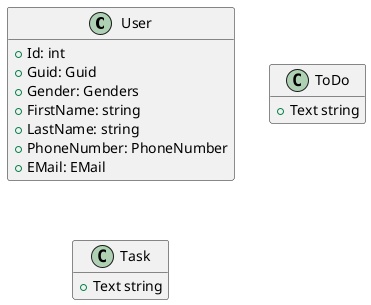

# Model

```plantuml

@startuml

class User {
    + Id: int
    + Guid: Guid
    + Gender: Genders
    + FirstName: string
    + LastName: string
    + PhoneNumber: PhoneNumber
    + EMail: EMail
}

class ToDo {
    + Text string
}

class Task {
    + Text string
}


hide empty members

@enduml

```